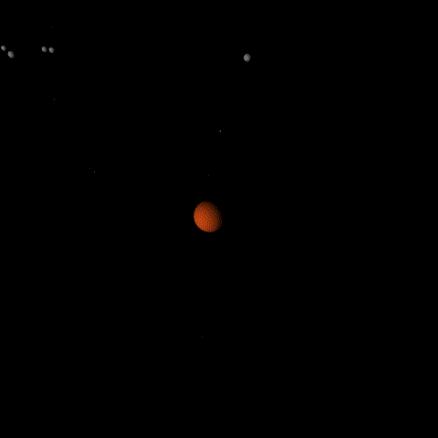
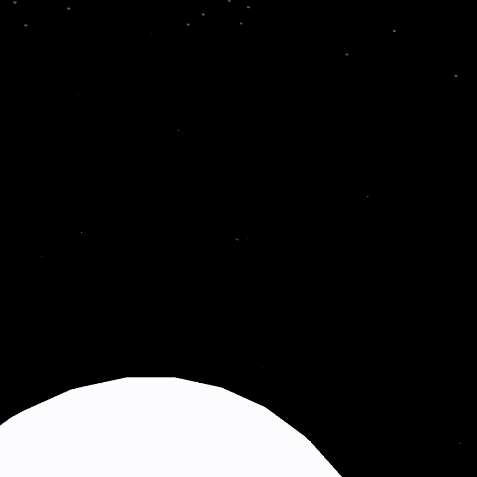

# Solar System

## Overview

This sketch was created for a course assignment using Processing to showcase its 3D-drawing capabilities. Due to technical limitations, I scaled down the distances of each planet to the sun by a factor of 100 units. The revolution of each planet had to be sped up to see interesting results.

Spatial proportions aside, the programming for orbits was a bit tricky. The planets were able to rotate around the sun simply because of the `rotate()` method. In the case of the Earth and its moon, I had to use the `pushMatrix()` and `popMatrix()` functions in the right order to avoid them from rotating around the wrong object or axis.

Overall, I enjoyed being able to kind of replicate the solar system, but there are some things that can improve the sketch:
* Keep actual orbital speeds
* Use actual distances to scale
* Allow the user to adjust the simulation speed
* Proper lighting of sun
* Add textures to planets
* Implement a more dynamic, interactive camera